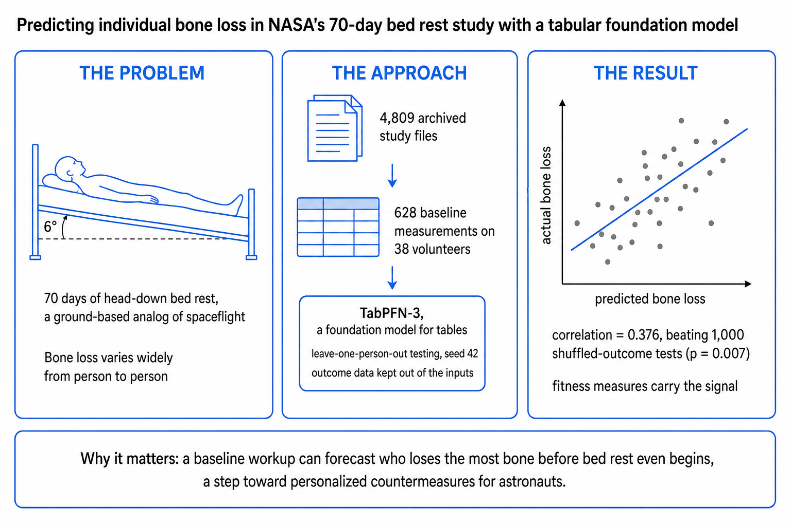

# RTS_Step1_c11 — Forecasting individual bed-rest responses with a tabular foundation model

**Status:** complete Step 1 analysis, frozen for release. Every number quoted in prose documents is verified against a file in this repository. Known deviations and corrections are listed in full under "Known limitations, deviations, and corrections" below.



## What this is

Spaceflight alters most physiological systems, and individuals differ widely in how they respond. NASA cannot yet accurately predict who is most at risk. The evidence lives in tabular health data from crews and ground analogs, in studies too small (n = 25 to 80) for classical machine learning. Tabular foundation models (TFMs) such as TabPFN are pre-trained on synthetic tables and predict in one forward pass, with no training, no fine-tuning, and no subject data retained for training.

This folder is the complete **Step 1** of a four-step program (full text in `docs/PROJECT_ABSTRACT.md`):

1. **Step 1 (this folder):** establish whether a TFM can predict individual responses at small n on one bed-rest campaign, and document where it breaks. Failure modes matter as much as successes.
2. **Step 2:** pool the C11 and C3 campaigns and benchmark TabPFN against TabICL, Google's TabFM, random forest, and XGBoost.
3. **Step 3:** design a standard pipeline for standard measures.
4. **Step 4:** apply the pipeline to ISS crew data.

**The Step 1 question.** In the NASA/UTMB C11 campaign (70 days of 6-degree head-down-tilt bed rest), can baseline pre-bed-rest measurements predict how much hip bone each individual will lose? The outcome is the change in total hip bone mineral density (BMD), post minus pre, for the 38 volunteers with paired scans. The predictors are 628 baseline measurements per volunteer. The model is TabPFN-3, tested by leaving one person out, training on the other 37, and repeating for all 38. The result (Spearman ρ = 0.376, p = 0.007 against 1,000 shuffled-outcome nulls) and every follow-up test are in `results/`. Hip bone density was the registered primary target, chosen before any model ran; the fat-mass and tandem-walk outcomes came later as negative controls.

This folder sits alongside `C11/` (J. Casaletto), which holds the per-dataset extraction scripts that built the raw material. This folder is the complete Step 1 analysis: build, modeling, bias battery, results, figures, and teaching assets.

## The pipeline at a glance


*From the raw NASA archive to a verified prediction: build the dataset, test the model against shuffled-outcome nulls, then rule out artifacts. Full walkthrough in `docs/PIPELINE.md`.*

## Quickstart

```bash
# 1. Environment (Python 3.11.13; GPU strongly recommended). See ENVIRONMENTS.md.
pip install -r requirements.txt --extra-index-url https://download.pytorch.org/whl/cu130

# 2. TabPFN-3 weights are gated and non-commercial. Register with PriorLabs,
#    then export your token (never hardcode it):
export TABPFN_TOKEN="your_token_here"

# 3. Reproduce the registered battery (commands and expected outputs in RUN_LOG.md)
python analysis/run_battery.py
```

The modeling table in `data/` is sufficient to reproduce every result in `results/`. To rebuild that table from the raw NASA archive instead, see `build/` (the archive itself is open access at NASA LSDA; `docs/DATA_PROVENANCE.md` names the exact source files).

## Folder map

| Path | Contents |
|---|---|
| `README.md` | This file |
| `RUN_LOG.md` | One line per executed run: date, script, command, output, model, version, seed |
| `ENVIRONMENTS.md` | Exact software, hardware, and model-weight record for every run |
| `requirements.txt` | Pinned Python environment |
| `build/` | Data engineering: raw LSDA archive → master table → modeling matrix, plus build reports (run order in `build/README.md`) |
| `analysis/` | The registered analysis battery; `analysis/exploratory/` holds the earlier pre-registration scripts |
| `data/` | The 38 × 628 modeling table, the subject-to-treatment-group map, and the feature dictionary |
| `results/` | Every number the project produced, organized by battery phase |
| `figures/` | Graphical abstract, pipeline flowchart, main figures fig1–fig7 (PNG + SVG) |
| `teaching/` | Finished educational assets: S1–S5 figure sets, pipeline teaching figures with generating scripts, teaching scripts and tables (map in `teaching/README.md`) |
| `docs/PIPELINE.md` | The full data journey, archive to answer, including every twist and dead end |
| `docs/DATA_PROVENANCE.md` | Exactly where the outcome and every feature come from |
| `docs/PROJECT_ABSTRACT.md` | The conference abstract, verbatim |
| `docs/GLOSSARY.md` | Plain-language definition of every technical term used in this folder |

## Terminology note

Prose and figures say **treatment group** (control / exercise / flywheel). File names and column names inside `results/` keep the shorter word **arm**, because the analysis scripts wrote those names. They mean the same thing; `docs/GLOSSARY.md` maps every variant. In the published study design the exercise treatment had two sub-groups (exercise alone, exercise plus testosterone); this analysis pools them into one exercise group, so the cohort is control 11, exercise 19, flywheel 8 (n = 38; 37 men, 1 woman).

## Known limitations, deviations, and corrections

This project keeps its problems in the open. Each item below states what happened and what it does or does not change. Items D1–D9 are deviations from the registered analysis plan; the rest are bugs found and fixed, or framing corrections.

**D9 — the one that affects the master table build (fix scheduled for Step 2):**

> The master-table build does not include the hip DXA ROI column in TIMEPOINT_KEYS. Rows for the four hip regions collapse to one arbitrary value in master_c11_v6_1.csv. Fix: add "roi" to TIMEPOINT_KEYS. Scheduled for the Step 2 pooled rebuild (v6.2). Impact on Step 1 results: none. The hip BMD modeling matrix was built by build_tfm_totalhipBMD.py, which reads ROI directly from the source file.

The last sentence is verified two ways: the builder's code filters the raw file to exactly the Left and Right Total Hip rows, and recomputing all 38 targets independently from the raw archive reproduces the shipped values exactly.

**Deviations from the registered plan (D1–D8), in plain language:**

| # | What happened | Impact |
|---|---|---|
| D1 | The planned 1,000 shuffles per null test were reduced to 500, 200, or 50 for the slowest tests so the battery would finish in reasonable time. | Those nulls have coarser resolution; every reported p-value is annotated with its shuffle count, and floor p-values are stated as resolution limits. |
| D2 | The environment was documented as tabpfn 8.2.0; a later reproduction session ran 8.3.0. | None found: the reproduction matched the headline correlation to 7 decimal places. |
| D3 | One arm-aware null test was paused at about 150 of its planned shuffles and never completed; an interim trend was viewed before the pause. | That test's observed statistics come from prose notes, not a saved file, and are labeled as such wherever mentioned. |
| D4 | The arm-aware observed values from the interrupted run cannot be byte-reproduced from saved artifacts. | They are never quoted as verified; the completed replacement tests (phase 5) stand on their own. |
| D5 | The script for one supplementary rich-grid comparison (hip outcome, XGBoost) was lost. | That single supplementary number is not quoted in this repository. |
| D6 | Three subjects (5159, 5210, 7036) were excluded from the tandem-walk control. | Verified against the saved tandem tables; exclusions are documented in `results/rebuilt_tables/`. |
| D7 | One screening test (Test 3) used a textbook asymptotic p-value instead of a shuffle-based one. | The test is a screen, not a conclusion; the shuffle-based tests around it are unaffected. |
| D8 | The registered plan said 1,000 shuffles where the executed battery used 500/200/50 (same fact as D1, recorded separately in the plan). | Same as D1. |

**Bugs found and fixed, and framing corrections:**

- **Stratified-null bug (B2).** The first version of the stratified label-null returned identical shuffled draws across repeats. It was caught, and the test was rerun with the fixed code (the "b2fix" runs). Only the rerun results are reported.
- **Double penalty in Test 3.** The first report applied the multiple-comparison penalty twice, changing one screening verdict from "1 of 16 passes" to "0 of 16". Under the registered rule the corrected answer is 1 of 16 (control group, total-fat measure, ρ = −0.80, p = 0.0039); the stricter line is kept as a sensitivity check. The correction is documented, and both versions are visible in the record.
- **Missingness fingerprint.** In the flywheel group, 357 of the 628 features are entirely absent, so a model could tell treatment groups apart just by looking at which cells were empty. Every early classification "success" was this artifact. It was found, documented, and remediated; `figures/fig7_missingness_fingerprint.png` shows it, and phase 4 of the battery reruns the affected tests on equal-footing feature sets.
- **Residualization leak.** One test removed treatment-group means using all subjects at once, which leaks a small amount of information across the train/test split. The fold-safe rerun (each held-out person never touches the fit) gives a *stronger* result (ρ = 0.665 vs 0.559), so the correction favors the finding.
- **"Clean test" framing.** Early notes described a missingness-free classification contrast. No 628-feature contrast is missingness-free; the corrected statement is that the mask alone separates control from exercise perfectly. Prose in this repository uses the corrected framing.

**Standing limitations:**

- n = 38, one campaign, no external validation cohort. The headline result is a feasibility signal, not a clinical predictor; Step 2 exists to test whether it survives pooling and replication.
- The exercise group pools two design sub-groups (exercise alone, exercise plus testosterone). Testosterone is bone-active, so the pool is biologically heterogeneous; pooling is a power choice at n = 38, and Step 2 should test sensitivity to it.
- 35.1% of cells in the modeling table are empty (verified by re-reading the file). No imputation is ever applied; empty stays empty.
- Whether the bone-density signal is individual biology, treatment-group membership, or measurement noise remains an open reading (A/B/C in `docs/PIPELINE.md`); the battery rules out the easy artifact explanations and the C3 cohort is the planned decider.
- The documented install on the battery machine is tabpfn 8.2.0; the battery result files record the version field as null; a later 8.3.0 session matched the headline. Flagged, not back-filled.

## Rules this project follows

1. **The raw archive is ground truth.** A published value never overrides an archive value.
2. **Unrecoverable data is flagged, never inferred.** See `results/extraction_audit.csv`.
3. **No secrets in the repo.** Tokens were scrubbed; set `TABPFN_TOKEN` yourself.
4. **No model weights in the repo.** TabPFN-3 checkpoints are under a non-commercial research license and are not redistributed here.
5. **Subject-level data.** The C11 archive is open access; the derived tables in `data/` contain subject-level records from that open archive.
6. **License and reuse.** Code and documents in this folder inherit the `nasa/AI4LS` repository license. The derived data tables come from the open-access NASA LSDA archive; cite the archive and Cromwell 2018 when reusing them.

## Contact

Ryan T. Scott (NASA OSDR/AI4LS). Questions on the extraction layer: see `C11/`.
