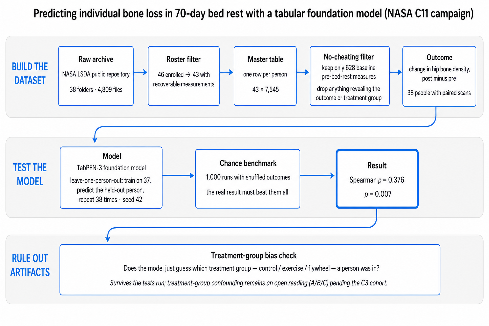

# PIPELINE.md — The Full Data Journey, Archive to Answer

**Status:** verified against stored artifacts. Every count below is verified against a stored artifact unless marked *(prose)*. Where a number could not be re-verified from preserved files, it is omitted rather than quoted.

## 1. Raw archive

- **4,809 files · 38 top-level folders · 126 MiB** retrieved from NASA LSDA for campaigns C1, C3, C11 (checksum-verified). Format breakdown: 3,553 CSV, 407 PDF, 322 txt, 259 zip, 140 md5sum, 89 png, 38 json, 1 docx.
- **Count disclosure.** The LSDA catalog listed 4,834 files as the expectation; 4,809 were verified on disk. The 25-file difference is not itemizable from preserved artifacts (the downloader's per-folder inventory JSON was not preserved; it can be regenerated by re-running the downloader's inventory step). Both numbers are stated here rather than one silently replacing the other.
- Header/encoding audit of all 3,553 CSVs (all readable): 869 BOM, 134 cp1252, 33 blank headers, 10 whitespace-padded, 8 duplicate headers.
- Arm-label audit: 512 files carry arm columns under **8 different header spellings** (GroupName 242, Group 176, Treatment 54, Intervention 26, GroupLabel 16, GROUP 15, Dose 7, Condition 2), with 234 distinct raw values. BEDREST_FTT is the authoritative arm source.

## 2. Subject funnel (never blend these counts)

| Count | Stage |
|---|---|
| 46 | C11 roster |
| 43 | rows in master table (8930, 9011, 9751 have no recoverable measurement) |
| 39 | non-trivial data (drop 6559, 9217, 9633, 8784 — near-empty rows) |
| **38** | hip-BMD Pre+Post pairs (drop 5016) — **the modeling n** |
| 37 | published completers (Cromwell 2018: 11 control / 10 iRAT / 8 Ex+T / 8 flywheel) |

## 3. Column funnel

~40,000 *(prose)* raw wide build → 11,453 *(prose)* (v6.0, phantom timepoint-as-measure columns removed) → **7,545** (v6.1, arm/GroupName/date/static-descriptor columns removed) → **628** (Aim-1 table: PRE-phase only, leakage-guarded, ≥80% subject coverage). The 7,545 and 628 counts are verified; the two earlier counts come from build notes.

## 4. Leakage guard

Two distinct removals, often confused:

1. **Arm/GroupName columns** removed at v6.1 (they encode treatment, not biology).
2. **The hip iDXA source file** (`BEDREST_IRATS_iDXA_CFT70_Body_Composition_Hips_obsv.csv`, 6 columns) excluded as a leakage family — it is the outcome's own source.

The regional bone features that remain (BMD/BMC for arms, legs, pelvis, spine, trunk, head, total) come from a **different file** (`NNX10AP86G_CFT70_iDXA`, whole-body regional scan) and are **baseline values**, not changes. Verified: zero hip-file columns appear among the 628.

## 5. Data land mines confirmed during curation

1. Subject 6546 = CONTROL in iDXA/MRI/FTT/PV/NNX10AP86G but EXERCISE in MR080G. Majority + Cromwell 2018 → CONTROL. MR080G GROUP column unreliable for 6546.
2. `BRSMPV_CFT70_PLASMA_VOLUME_Results.csv` contains only 6 subjects; `all_subjects.csv` has 37. Using Results.csv silently drops 31 subjects.
3. BRSMPV vs FTT plasma volume: 17/70 subject-phase pairs differ by >0.05 L (max 0.30 L), corr 0.98. Canonical source = BRSMPV (dedicated CO-rebreathing assay).
4. C3 VO2peak: 4 column conventions across 91 Peak files. Normalized.
5. C3 subject ID artifacts: '7352.0' float; campaign code in filename not SUBJECT column.
6. C1 subject ID typo: 'CIG0003' (letter I) vs 'C1G0003' (digit 1).
7. C1 contributes almost nothing to pre/post change endpoints (3 subjects, PRE only, DXA no phase). C1's value is bone biochemistry C11 lacks.
8. Phase-label babel: iDXA 'Pre/Test1-4/Post'; MR080G 'PRE/POST1/POST2'; BRSMPV/FTT/C3 'PRE_TEST/IN_TEST/POST_TEST'; C1 DXA none.
9. C3 Total Hip BMD partial: iterations C3A/C3B lack the column. **Unrecoverable — flagged, not inferred.**

## 6. Modeling harness

- Model: TabPFN-3 (tabpfn package; see RUN_LOG.md for version per run), `n_estimators=32`, model seed 42, deterministic algorithms on.
- Validation: leave-one-out CV — train on 37, predict 1, repeat for all 38; the metric is computed once over the 38 held-out predictions, never per-fold averaged.
- Permutation seed policy: `seed[i] = i`, recorded per row.
- Reproduction gate: before the battery ran, the pipeline re-computed the headline correlation on the battery machine and matched the exploratory-run value (expected 0.3762039, observed 0.3762038995750089; gate passed) — `results/phase2_arm_aware/prerequisite_results.json`.

## 7. The battery (what each phase answers)

| Phase | Question | Outputs |
|---|---|---|
| `phase1_classification` | Can the same features classify arm? (C1 multi-class, C2 pairwise, C3/C4 controls) | `results/phase1_classification/` |
| `phase2_arm_aware` | Does the BMD signal survive arm membership? Prerequisite gate, Test 1 (stratified null), Test 2 (arm-residualized), Test 3 (Reading C screen) | `results/phase2_arm_aware/` |
| `phase3_fat_tandem` | Negative controls: fat-mass change and tandem-walk performance | `results/phase3_fat_tandem/` |
| `phase4_missingness_remediation` | Is the arm signal just missingness patterns? A-core / B-maskfull / Bcore-maskcore / R1 fold-safe | `results/phase4_missingness_remediation/` |
| `phase5_nulls` | Final nulls: B1 (fold-safe regression null), B2 (A-core CONTROL vs FLY label null) | `results/phase5_nulls/` |

The three "readings" the arm-aware battery adjudicates:

- **Reading A (individual biology):** the model ranks subjects within their own arm. Real signal.
- **Reading B (arm membership):** the model only detects arm and uses it as a proxy. Artifact.
- **Reading C (noise ranking):** the model's errors track body composition, i.e. it ranks DXA measurement noise, not biology.

**How to read the nulls.** The shuffled-outcome null distributions are NOT centered at zero: the Test 1 null sits at ρ ≈ −0.405 ± 0.276 and the Test 2 null at −0.271 ± 0.261 (recorded in the phase JSONs). This is a known property of small-n leave-one-person-out harnesses whose predictions shrink toward the training mean — a model that knows nothing produces *negative* rank correlations on this target (demonstrated in `teaching/scripts/offcenter_null_loocv.py`). The correct comparison is always the observed value against its own null distribution, never against zero: the observed 0.376 sits about 2.8 null-standard-deviations above the Test 1 null mean.

Verdicts and statistics for each are in the phase folders; the headline and null summaries are collated in `results/all_tfm_results_master.csv`.

## 8. Known limitations

- n = 38, single campaign, no external validation cohort. Reading A is provisional until replicated.
- 35.1% of cells in the modeling table are NaN (verified by re-reading the file).
- The documented TabPFN install on the battery machine is 8.2.0 (run log, 2026-08-16); battery result JSONs record the version field as null; a later reproduction session used 8.3.0 and matched the headline. Flagged, not back-filled.
- The tandem-walk negative control is significantly *worse* than chance (anti-predictive), not merely non-significant — read the phase3 JSON before citing it.
- The master-table build does not carry the hip DXA ROI column, so the four hip regions collapse to one arbitrary value in `master_c11_v6_1.csv` (deviation D9 in the README). Impact on Step 1: none — the modeling target is rebuilt from the raw Hips file by `build/build_tfm_totalhipBMD.py`, verified by recomputing all 38 targets from the archive. Fix scheduled for the Step 2 pooled rebuild (v6.2).

## 9. What to build next

1. External validation cohort (campaign-held-out or independent bed rest study).
2. Mechanistic follow-up on the top fitness-domain features.
3. Random forest and other baselines on the identical LOOCV harness (the current comparison covers TabPFN, TabICL, XGBoost).
